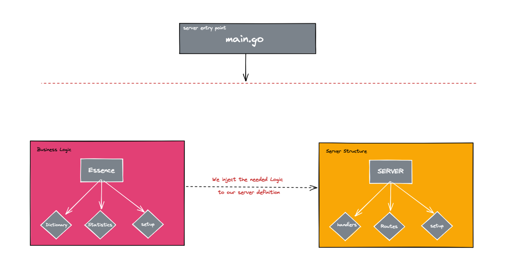

#   Simple Dictionary management server - Task for AssuredAllies  

Table of contents
- [Overview](#overview)
- [Technical description and design explanation](#technical-description-and-design-explanation)
    - [Main Packages](#main-packages)
- [Usage](#usage)
- [Linting workspace](#linting-workspace)
- [Potential different approaches and additions.](#potential-different-approaches-and-additions)

## Overview
 
 Dictionary management server is a simple server that helps dong some operations over a dictionary, and be able to see statistics. 
____________ 

## Technical description and design explanation

### a. Main packages :




**Essence** : _This package represents the business logic of the system, components that is used as an "essence" in other components e.g : Dictionary ,Statistics ... etc_.

**Server** : _This package represents the server logic such as: server structs definition with the needed business logic components, APIs handlers definition_.

**Images** : _To be used in the README._

____________ 

## Usage 

### **- To run the project locally:**
1. Clone repository or download the archive

    ```
    git clone git@github.com:muhammedar/assuredAlliesTask.git
    ```
    
2. Set the location of the dictionary txt file as `ENV variable`.

3. Build the project:
   ```
    go build
    ```
5. Run the project:
    ```
    ./dictionaryManager.com   
    ```
6. Server is accessible through https://localhost:8080/


## Linting workspace
- Workspace is linted using `golangci-lint run`

___________ 

## Potential different approaches and additions. 

1. Some go writers like the related go components to be next to each other,
personally I prefer the approach that I used, As I feel it gives more space for code scalability, and make the maintenance of the code more easier.

2. If we will look at the project as a part of a microservices, then the above approach might be more fit, as it encapsulate the related things together. 

3. Unit testing should be added. 

4. A more accurate way to calculate the requests times, with more detailed numbers.


